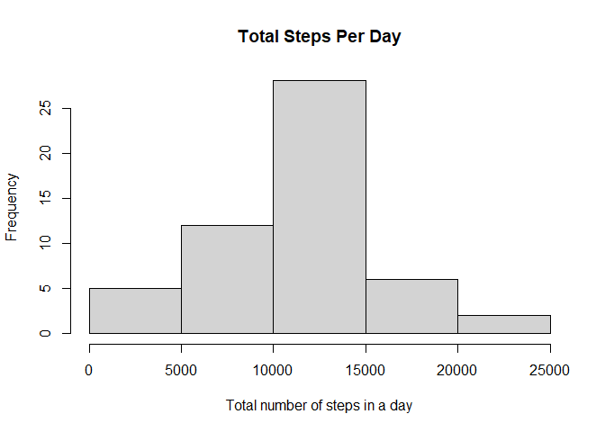
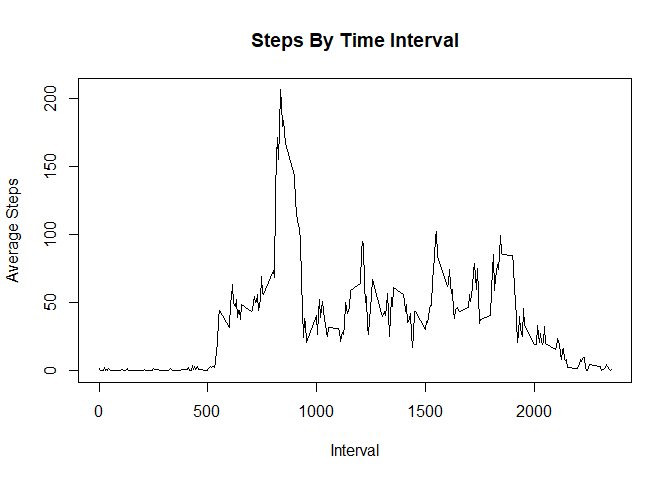
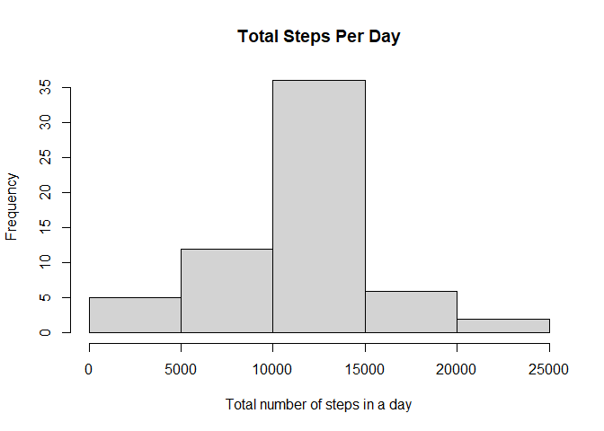
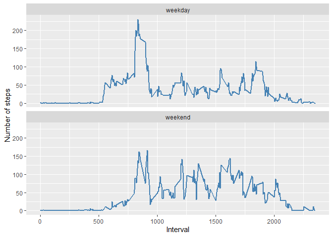

## Loading and preprocessing the data


```r
activity <- read.csv("activity.csv")
```

## What is mean total number of steps taken per day?

1. Calculate the total number of steps taken per day  


```r
library(dplyr)
```

```
## 
## Attaching package: 'dplyr'
```

```
## The following objects are masked from 'package:stats':
## 
##     filter, lag
```

```
## The following objects are masked from 'package:base':
## 
##     intersect, setdiff, setequal, union
```

```r
library(ggplot2)


activity_recorded <- activity[!is.na(activity$steps),]

activity_recorded$date <- as.Date(activity_recorded$date)

activity_sum <- activity_recorded %>%
      group_by(date) %>%
      summarize(steps_per_day=sum(steps))
```

```
## `summarise()` ungrouping output (override with `.groups` argument)
```

```r
head(activity_sum)
```

```
## # A tibble: 6 x 2
##   date       steps_per_day
##   <date>             <int>
## 1 2012-10-02           126
## 2 2012-10-03         11352
## 3 2012-10-04         12116
## 4 2012-10-05         13294
## 5 2012-10-06         15420
## 6 2012-10-07         11015
```
2. Make a histogram of the total number of steps taken each day  


```r
hist(activity_sum$steps_per_day, main="Total Steps Per Day", xlab="Total number of steps in a day")
```

<!-- -->
  
3.Calculate and report the mean and median of the total number of steps taken per day.  

Answer: mean (10,766), median(10,765)  

```r
summary(activity_sum$steps_per_day)
```

```
##    Min. 1st Qu.  Median    Mean 3rd Qu.    Max. 
##      41    8841   10765   10766   13294   21194
```

## What is the average daily activity pattern?

1. Make a time series plot (i.e. type = "l") of the 5-minute interval (x-axis) and the average number of steps taken, averaged across all days (y-axis)  


```r
activity_avg <- activity_recorded %>%
      group_by(interval) %>%
      summarize(steps_per_day=mean(steps))
```

```
## `summarise()` ungrouping output (override with `.groups` argument)
```

```r
plot(activity_avg$interval, activity_avg$steps_per_day, type="l", main = "Steps By Time Interval", xlab = "Interval", ylab = "Average Steps")
```

<!-- -->
  
2. Which 5-minute interval, on average across all the days in the dataset, contains the maximum number of steps?  

Answer: 835  

```r
#locate index
row_maximum_steps <- which.max(activity_avg$steps_per_day)

activity_avg[row_maximum_steps, ]
```

```
## # A tibble: 1 x 2
##   interval steps_per_day
##      <int>         <dbl>
## 1      835          206.
```
## Imputing missing values

1. Calculate and report the total number of missing values in the dataset (i.e. the total number of rows with NAs).  

Answer: 2304  


```r
summary(activity)
```

```
##      steps            date              interval     
##  Min.   :  0.00   Length:17568       Min.   :   0.0  
##  1st Qu.:  0.00   Class :character   1st Qu.: 588.8  
##  Median :  0.00   Mode  :character   Median :1177.5  
##  Mean   : 37.38                      Mean   :1177.5  
##  3rd Qu.: 12.00                      3rd Qu.:1766.2  
##  Max.   :806.00                      Max.   :2355.0  
##  NA's   :2304
```
2. Devise a strategy for filling in all of the missing values in the dataset. The strategy does not need to be sophisticated. For example, you could use the mean/median for that day, or the mean for that 5-minute interval, etc.  


```r
activity_na <- activity[is.na(activity$steps),] 

activity_replace <- merge(x=activity_na,y=activity_avg,by="interval") %>%
subset(select = -c(steps)) 

activity_replace$date <- as.Date(activity_replace$date)

colnames(activity_replace)[colnames(activity_replace) == "steps_per_day"] <- "steps"
```
3. Create a new dataset that is equal to the original dataset but with the missing data filled in.  

```r
activity_all <- rbind(activity_replace, activity_recorded)
```
4a. Make a histogram of the total number of steps taken each day and Calculate and report the mean and median total number of steps taken per day. Do these values differ from the estimates from the first part of the assignment? What is the impact of imputing missing data on the estimates of the total daily number of steps?  


```r
activity_sum_all <- activity_all %>%
      group_by(date) %>%
      summarize(steps_per_day=sum(steps))
```

```
## `summarise()` ungrouping output (override with `.groups` argument)
```

```r
hist(activity_sum_all$steps_per_day, main="Total Steps Per Day", xlab="Total number of steps in a day")
```

<!-- -->
  
4b. Calculate and report the mean and median total number of steps taken per day. Do these values differ from the estimates from the first part of the assignment? What is the impact of imputing missing data on the estimates of the total daily number of steps?  

Answer: mean (10,766), median(10,766)  

```r
summary(activity_sum_all$steps_per_day)
```

```
##    Min. 1st Qu.  Median    Mean 3rd Qu.    Max. 
##      41    9819   10766   10766   12811   21194
```
4c. What is the impact of imputing missing data on the estimates of the total daily number of steps?  

Answer:  

Median: Before 10765, After 10766, Change -1  
Mean: Before 10766, After 10766, Change 0  

No significant change was made.  


## Are there differences in activity patterns between weekdays and weekends?

1. Create a new factor variable in the dataset with two levels – “weekday” and “weekend” indicating whether a given date is a weekday or weekend day.  


```r
activity_all_daytype <- activity_all
activity_all_daytype$weekday <- ifelse(weekdays(as.Date(activity_all_daytype$date)) %in% c("Saturday", "Sunday"), "weekend", "weekday")
```
2. Make a panel plot containing a time series plot (i.e. type = "l") of the 5-minute interval (x-axis) and the average number of steps taken, averaged across all weekday days or weekend days (y-axis). See the README file in the GitHub repository to see an example of what this plot should look like using simulated data.  


```r
activity_all_daytype_group <- activity_all_daytype %>%
       group_by(weekday, interval) %>%
       summarize(steps_average=mean(steps))
```

```
## `summarise()` regrouping output by 'weekday' (override with `.groups` argument)
```

```r
ggplot(data = activity_all_daytype_group, aes(interval, steps_average)) +
  geom_line(color = "steelblue", size = 1) +
  labs(y = "Number of steps", x = "Interval") + 
  facet_wrap(~weekday, ncol=1)
```

<!-- -->

